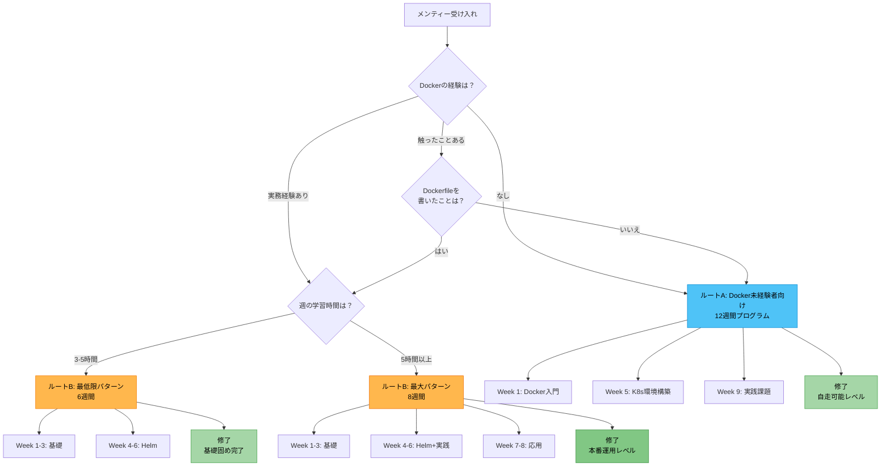
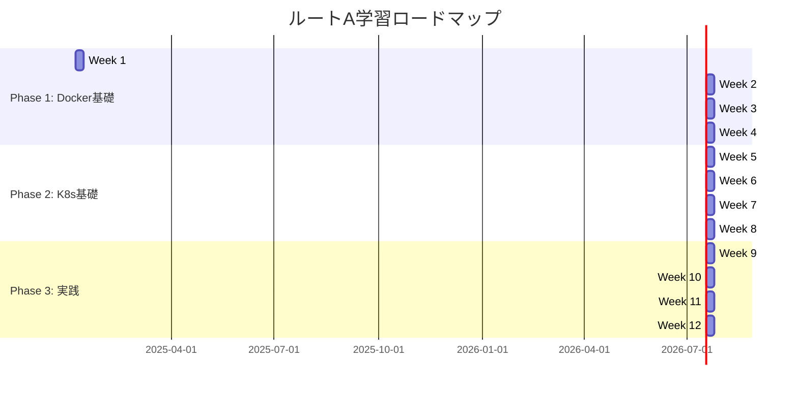
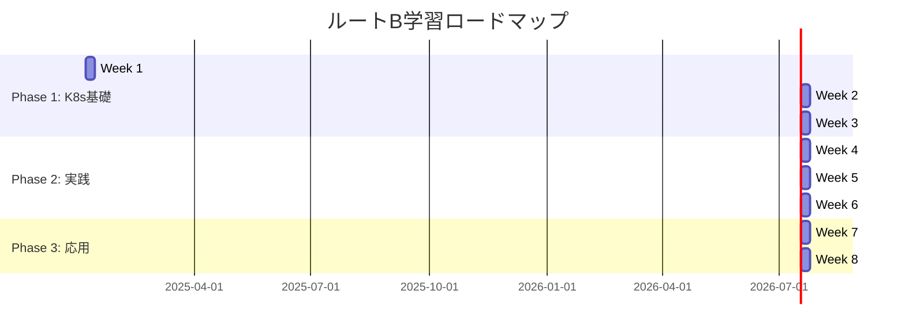
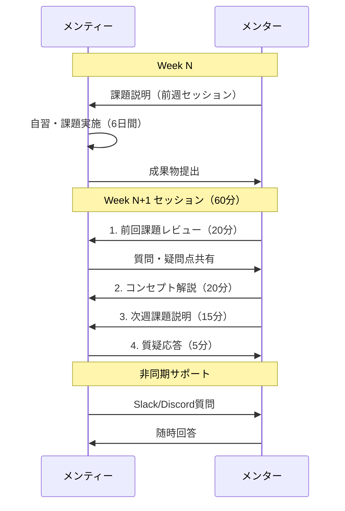
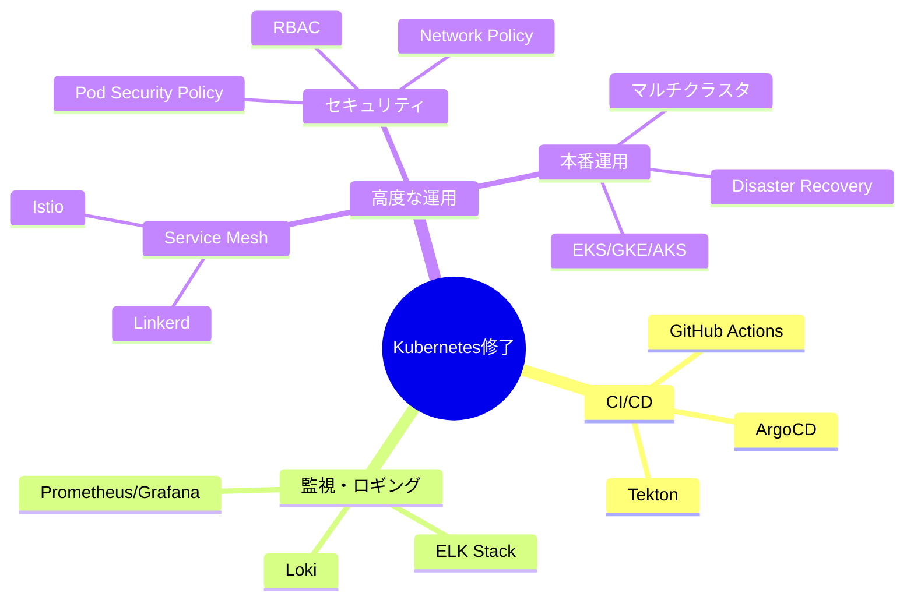

# Kubernetes学習プラン（メンター用）

週1回のメンタリングセッションで進める、課題ベースのKubernetes学習プログラム

## 📋 目次

- [事前確認（第0週）](#事前確認第0週)
- [ルート選択フロー](#ルート選択フロー)
- [ルートA: Docker未経験者向け（12週間）](./route-a-docker-beginner.md)
- **ルートB: Docker経験者向け**
  - [最低限パターン（6週間）](./route-b-minimum.md) ← 基礎固め
  - [最大パターン（8週間）](./route-b-docker-experienced.md) ← 本番運用レベル
- [メンタリング運用ガイド](#メンタリング運用ガイド)

---

## 事前確認（第0週）

### ヒアリング項目

初回セッションで以下を確認し、適切なルートを選択します：

| 項目 | 選択肢 | 重要度 |
|---|---|---|
| **Dockerの経験** | なし / 触ったことある / 実務経験あり | ⭐⭐⭐ |
| **学習の目的** | 個人学習 / 業務で必要 / 転職準備 | ⭐⭐ |
| **週の学習時間** | 2-3時間 / 5時間以上 | ⭐⭐ |
| **開発環境** | Mac / Windows / Linux | ⭐ |

---

## ルート選択フロー

---

## 全体像

### ルートA: Docker未経験者向け（12週間）

### ルートB: Docker経験者向け（8週間）

---

## 学習の進め方

### 週次サイクル

---

## メンタリング運用ガイド

### セッション構成（60分）

| 時間 | 内容 | ポイント |
|---|---|---|
| 0-20分 | **前回課題レビュー** | 成果物確認、質問対応、つまづき分析 |
| 20-40分 | **コンセプト解説** | 今週のトピック、実務での位置づけ |
| 40-55分 | **次週課題説明** | 課題内容、ゴール設定、ヒント提供 |
| 55-60分 | **質疑応答** | オープンQ&A |

### メンターの心得

#### ✅ DO

- 手を動かさせることを最優先
- 「なぜ必要か」を常に意識させる
- 実践 → 理論の順で説明
- 詰まったら非同期でサポート
- 成功体験を積ませる

#### ❌ DON'T

- 理論から入らない
- 答えを教えすぎない
- 完璧を求めない
- 進度を急がせない

### 課題評価基準

| レベル | 状態 | 対応 |
|---|---|---|
| 🟢 **優秀** | 課題完了 + 発展課題実施 | 次のステップ提示 |
| 🟡 **合格** | 課題完了 | 理解度確認して次へ |
| 🟠 **要復習** | 課題完了も理解不足 | 補足説明、類似課題追加 |
| 🔴 **未完了** | 課題未完 | 1週延長、難易度調整 |

---

## 各ルートの詳細

### ルートA: Docker未経験者向け
- [12週間プログラム](./route-a-docker-beginner.md)
- Dockerの基礎から学ぶ
- Kubernetesの実践まで

### ルートB: Docker経験者向け

| パターン | 期間 | 到達レベル | 推奨する人 |
|---|---|---|---|
| [最低限](./route-b-minimum.md) | 6週間 | 基礎固め | 週3-5時間、まず基礎を確実に |
| [最大](./route-b-docker-experienced.md) | 8週間 | 本番運用可能 | 週5時間以上、実務で即戦力になりたい |

**迷ったら最低限パターンから**。Week 6修了後に最大パターンに切り替えも可能。

---

## 修了基準

### ルートA修了時のゴール

- ✅ Dockerの基本が理解できている
- ✅ Kubernetesの基本リソース（Pod/Deployment/Service/Ingress）が使える
- ✅ YAMLマニフェストが自分で書ける
- ✅ Helmチャートが作成できる
- ✅ 簡単なアプリをKubernetesにデプロイできる

### ルートB修了時のゴール

- ✅ Kubernetesの実践的な運用知識がある
- ✅ Helmを使った環境別管理ができる
- ✅ ヘルスチェック、リソース制限などの本番考慮ができる
- ✅ オートスケーリング、ローリングアップデートが理解できている
- ✅ 実務でKubernetesを適用できるレベル

---

## 次のステップ（修了後）

---

## 参考リンク

- [Kubernetes公式ドキュメント](https://kubernetes.io/ja/docs/home/)
- [Docker公式ドキュメント](https://docs.docker.com/)
- [Helm公式ドキュメント](https://helm.sh/docs/)
- [Kubernetes The Hard Way](https://github.com/kelseyhightower/kubernetes-the-hard-way)
