# ルートA: Docker未経験者向け（12週間）

Dockerの基礎から始めて、Kubernetesの実践的な使い方まで習得する12週間プログラム

---

## 全体構成

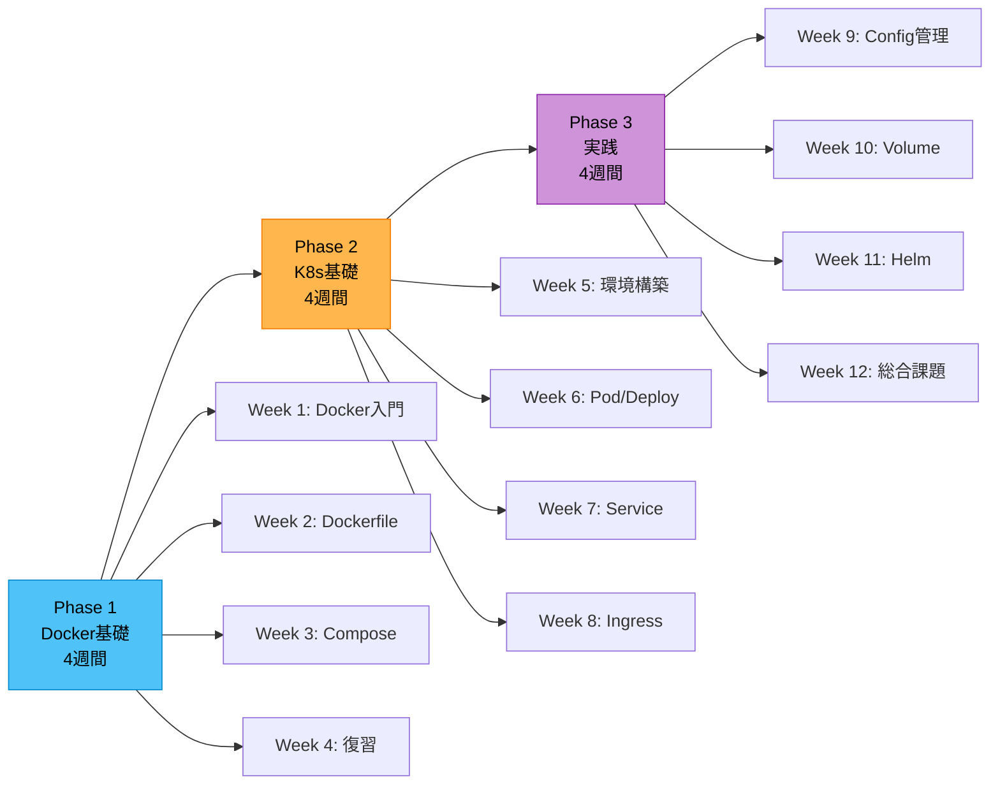

---

## Phase 1: Docker基礎（Week 1-4）

### Week 1: Docker入門

#### 今週の目標

- Dockerとは何かを理解する
- コンテナとVMの違いを説明できる
- 基本的なDockerコマンドが使える

#### システム構成図

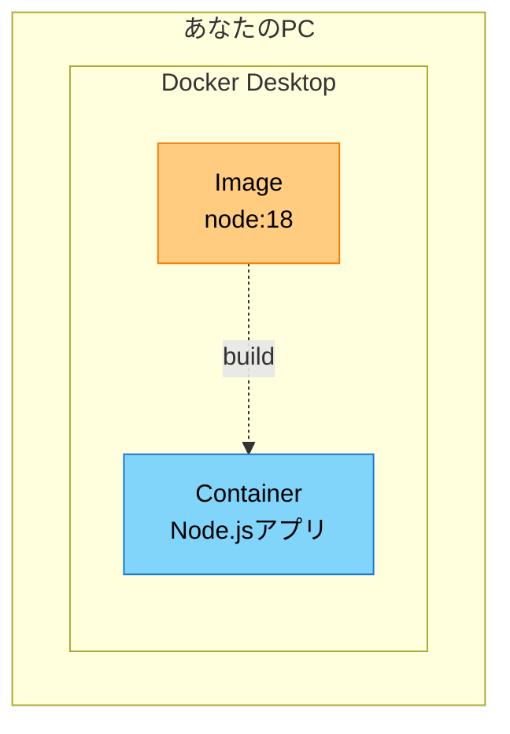

#### 課題

シンプルなNode.js Express アプリをDockerで動かす

**成果物**:
- [ ] `Dockerfile`作成
- [ ] `docker build`でイメージ作成
- [ ] `docker run`でコンテナ起動
- [ ] `http://localhost:3000`でアプリ動作確認
- [ ] スクリーンショット提出

**サンプルコード**:
```javascript
// app.js
const express = require('express');
const app = express();

app.get('/', (req, res) => {
  res.send('Hello from Docker!');
});

app.listen(3000, () => {
  console.log('App running on port 3000');
});
```

**Dockerfile雛形**:
```dockerfile
FROM node:18
WORKDIR /app
# TODO: package.jsonをコピー
# TODO: npm install実行
# TODO: ソースコードをコピー
CMD ["node", "app.js"]
```

#### セッションで話すこと

- コンテナとは何か（プロセスの隔離）
- イメージとコンテナの関係（クラスとインスタンス）
- VMとの違い（軽量、起動が早い）
- `docker build` / `docker run` / `docker ps`の基本

#### 確認ポイント

- ✅ Dockerfileが書けるか
- ✅ イメージとコンテナの違いを説明できるか
- ✅ ポートマッピング（`-p`）の意味を理解しているか

---

### Week 2: Dockerfileのベストプラクティス

#### 今週の目標

- マルチステージビルドを理解する
- イメージサイズを削減できる
- ビルドキャッシュを活用できる

#### システム構成図

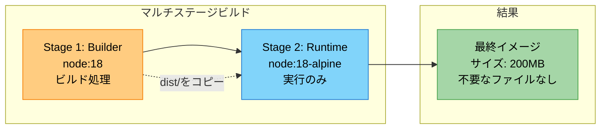

#### 課題

Next.jsアプリをマルチステージビルドで最適化

**成果物**:
- [ ] マルチステージDockerfile作成
- [ ] イメージサイズ削減（ビフォー・アフター比較）
- [ ] `.dockerignore`作成
- [ ] ビルド時間計測

**Before/After比較表**:
| 項目 | Before | After |
|---|---|---|
| イメージサイズ | ??? MB | ??? MB |
| ビルド時間 | ??? 秒 | ??? 秒 |
| レイヤー数 | ??? | ??? |

#### セッションで話すこと

- レイヤーキャッシュの仕組み
- `.dockerignore`の重要性
- マルチステージビルドの利点
- セキュリティ（不要なツールを含めない）

#### 確認ポイント

- ✅ マルチステージビルドが書けるか
- ✅ キャッシュを意識した`COPY`の順序を理解しているか
- ✅ イメージサイズ削減の理由を説明できるか

---

### Week 3: Docker Compose

#### 今週の目標

- 複数コンテナを連携させられる
- ネットワークとボリュームを理解する
- 環境変数の扱いを学ぶ

#### システム構成図

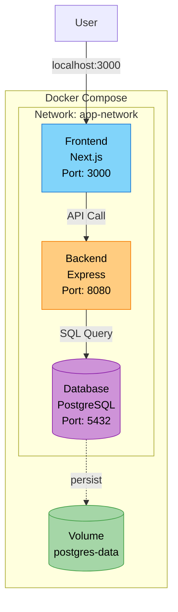

#### 課題

フロントエンド + バックエンド + PostgreSQLの3層構成を構築

**成果物**:
- [ ] `docker-compose.yml`作成
- [ ] 3つのサービスが起動
- [ ] フロントエンドからバックエンド経由でDBアクセス成功
- [ ] データ永続化確認（`docker-compose down`後も残る）

**docker-compose.yml雛形**:
```yaml
version: '3.8'
services:
  frontend:
    build: ./frontend
    ports:
      - "3000:3000"
    # TODO: 環境変数設定
    depends_on:
      - backend

  backend:
    build: ./backend
    # TODO: ポート、環境変数、depends_on設定

  postgres:
    image: postgres:15
    # TODO: 環境変数、ボリューム設定

# TODO: ネットワーク、ボリューム定義
```

#### セッションで話すこと

- Composeのユースケース（開発環境）
- サービス間通信（DNS名）
- ボリュームとバインドマウントの違い
- 環境変数の管理（.env）

#### 確認ポイント

- ✅ サービス間通信が理解できているか
- ✅ ボリュームでデータ永続化できるか
- ✅ `depends_on`の役割を理解しているか

---

### Week 4: Docker復習 + 次への準備

#### 今週の目標

- Dockerの理解を固める
- Kubernetesが必要になる理由を知る
- 自分で選んだアプリをDocker化できる

#### Dockerの限界

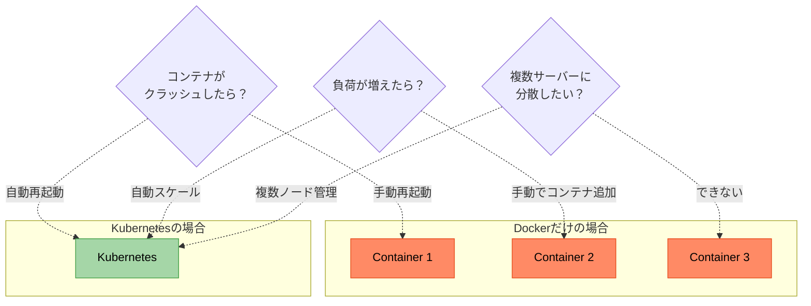

#### 課題

自分で選んだアプリ（既存または新規）をDocker化

**成果物**:
- [ ] 選んだアプリのDocker化
- [ ] `README.md`作成（起動手順）
- [ ] GitHub リポジトリ
- [ ] 「なぜKubernetesが必要か」のレポート（300字程度）

#### セッションで話すこと

- Dockerの限界（スケーリング、障害復旧、複数ホスト）
- Kubernetesが解決する問題
- コンテナオーケストレーションとは

#### 確認ポイント

- ✅ Dockerの基本が身についているか
- ✅ Kubernetesの必要性を理解しているか
- ✅ 自走してDocker化できるか

---

## Phase 2: Kubernetes基礎（Week 5-8）

### Week 5: Kubernetes環境構築

#### 今週の目標

- Kubernetesとは何かを理解する
- minikubeを起動できる
- kubectlでリソースを確認できる

#### Kubernetesアーキテクチャ

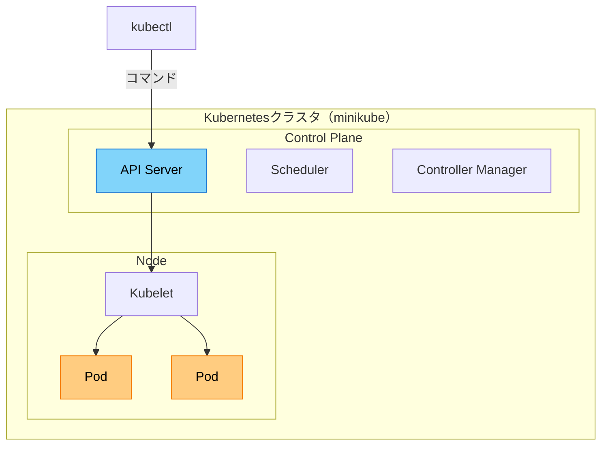

#### 課題

minikube起動とkubectl基本操作

**成果物**:
- [ ] minikube起動成功
- [ ] `kubectl get nodes`実行結果
- [ ] `kubectl get pods --all-namespaces`実行結果
- [ ] 基本コマンドリスト作成

**基本コマンド**:
```bash
# クラスタ起動
minikube start

# TODO: ノード確認コマンド
# TODO: Pod確認コマンド
# TODO: サービス確認コマンド
# TODO: ログ確認コマンド
```

#### セッションで話すこと

- Kubernetesとは（コンテナオーケストレーター）
- クラスタ、ノード、Podの関係
- kubectl基本操作
- 宣言的管理（YAML）

#### 確認ポイント

- ✅ minikubeが起動できるか
- ✅ kubectlの基本コマンドが使えるか
- ✅ クラスタ構成を説明できるか

---

### Week 6: Pod/Deployment

#### 今週の目標

- Podの役割を理解する
- Deploymentで管理する理由を知る
- YAMLマニフェストが書ける

#### Pod vs Deployment

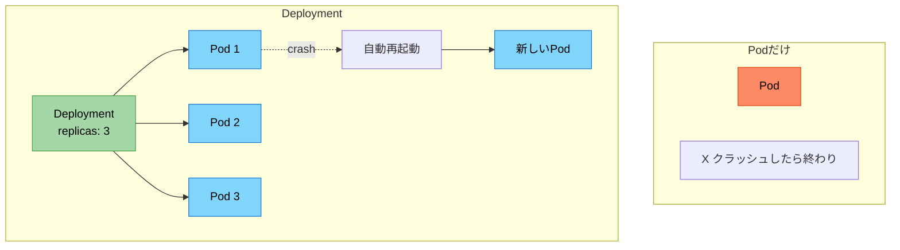

#### 課題

Week 3のバックエンドをKubernetesにデプロイ

**成果物**:
- [ ] `backend-deployment.yaml`作成
- [ ] `kubectl apply -f`でデプロイ
- [ ] `kubectl get pods`で確認
- [ ] `kubectl logs`でログ確認
- [ ] Podを削除して自動再起動を確認

**deployment.yaml雛形**:
```yaml
apiVersion: apps/v1
kind: Deployment
metadata:
  name: backend
spec:
  replicas: 2  # 2つのPodを起動
  selector:
    # TODO: ラベルセレクタ設定
  template:
    metadata:
      # TODO: ラベル設定
    spec:
      containers:
      - name: backend
        # TODO: イメージ、ポート設定
```

#### セッションで話すこと

- Podとは何か（コンテナのグループ）
- Deploymentの役割（レプリカ管理、自動回復）
- YAMLの基本構造
- ラベルとセレクタ

#### 確認ポイント

- ✅ YAMLが書けるか
- ✅ Podのライフサイクルを理解しているか
- ✅ Deploymentの必要性を説明できるか

---

### Week 7: Service/Networking

#### 今週の目標

- Serviceの役割を理解する
- Pod間通信ができる
- ClusterIP/NodePort/LoadBalancerの違いを知る

#### Service種類

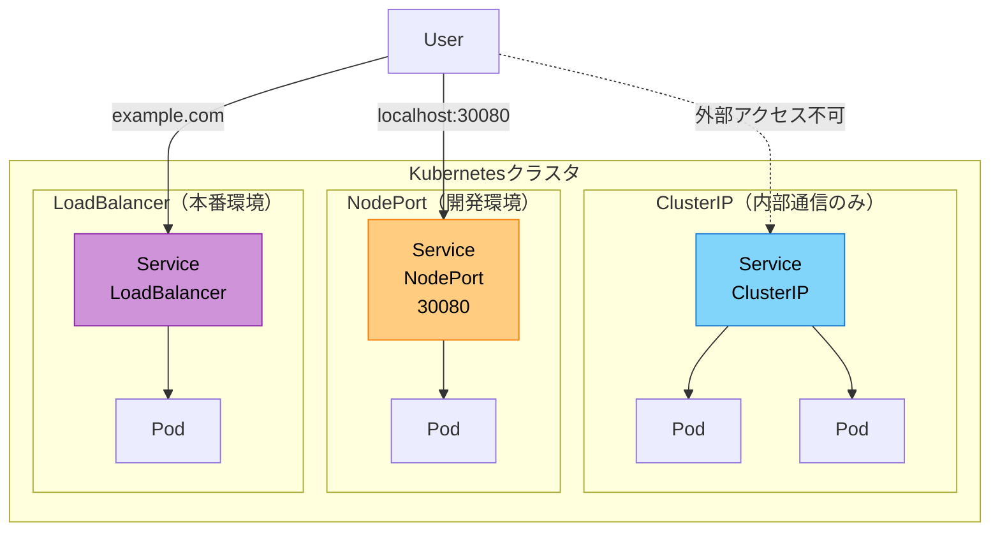

#### 課題

フロントエンド + バックエンド + PostgreSQLをKubernetesにデプロイ

**成果物**:
- [ ] 3つのDeployment + Service作成
- [ ] Pod間通信成功（frontend → backend → postgres）
- [ ] Service種類の理解レポート
- [ ] DNS名でアクセス確認

**構成図**:
```
Frontend (NodePort 30080)
  ↓ http://backend-service:8080
Backend (ClusterIP)
  ↓ postgresql://postgres-service:5432
PostgreSQL (ClusterIP)
```

#### セッションで話すこと

- Serviceの役割（ロードバランサー、サービスディスカバリー）
- ClusterIP/NodePort/LoadBalancerの使い分け
- DNS名によるPod間通信
- ラベルセレクタによる紐付け

#### 確認ポイント

- ✅ サービス間通信が理解できているか
- ✅ Service種類を説明できるか
- ✅ DNS名でアクセスできるか

---

### Week 8: Ingress

#### 今週の目標

- Ingressの役割を理解する
- パスベースルーティングができる
- 1つのURLで全体にアクセスできる

#### Ingress構成

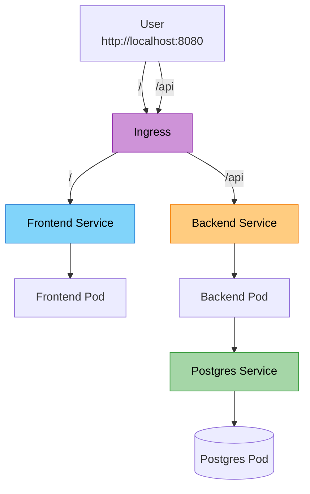

#### 課題

Ingressでパスベースルーティング

**成果物**:
- [ ] `ingress.yaml`作成
- [ ] `kubectl port-forward`でアクセス
- [ ] `/` → フロントエンド
- [ ] `/api` → バックエンド
- [ ] ブラウザで動作確認

**ingress.yaml雛形**:
```yaml
apiVersion: networking.k8s.io/v1
kind: Ingress
metadata:
  name: todo-ingress
spec:
  rules:
  - http:
      paths:
      # TODO: /api → backend
      # TODO: / → frontend
```

#### セッションで話すこと

- Ingress Controllerの役割
- パスベースルーティング
- 本番でのロードバランサー
- TLS/SSL終端

#### 確認ポイント

- ✅ Ingressが設定できるか
- ✅ パスルーティングを理解しているか
- ✅ 外部公開の仕組みを説明できるか

---

## Phase 3: 実践（Week 9-12）

### Week 9: ConfigMap/Secret

#### 今週の目標

- 設定と機密情報を分離できる
- ConfigMapとSecretの違いを理解する
- 12-factor appの考え方を知る

#### ConfigMap vs Secret

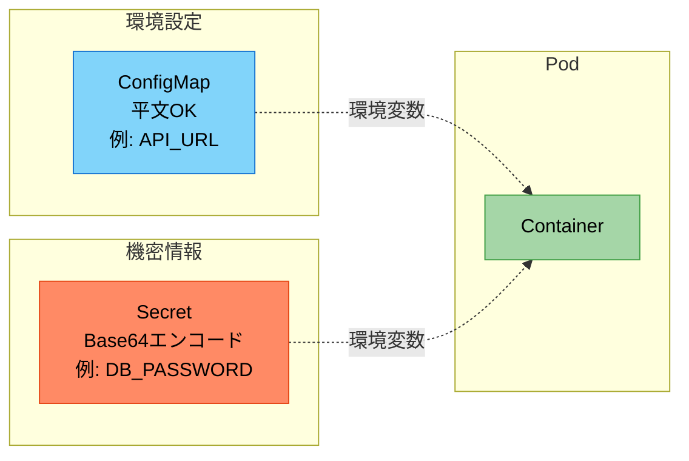

#### 課題

DB接続情報をSecretに移行

**成果物**:
- [ ] `postgres-secret.yaml`作成
- [ ] Deploymentで環境変数として注入
- [ ] ハードコードされた値を全て外部化
- [ ] セキュリティレポート

#### セッションで話すこと

- ConfigMapとSecretの使い分け
- 環境変数 vs ボリュームマウント
- Base64エンコードの意味
- 本番でのシークレット管理（外部KMS）

#### 確認ポイント

- ✅ ConfigMapとSecretが作成できるか
- ✅ 機密情報の扱いを理解しているか
- ✅ 12-factor appの概念を知っているか

---

### Week 10: PersistentVolume

#### 今週の目標

- データ永続化の仕組みを理解する
- PV/PVCの関係を知る
- StatefulSetとDeploymentの違いを学ぶ

#### Volume構成

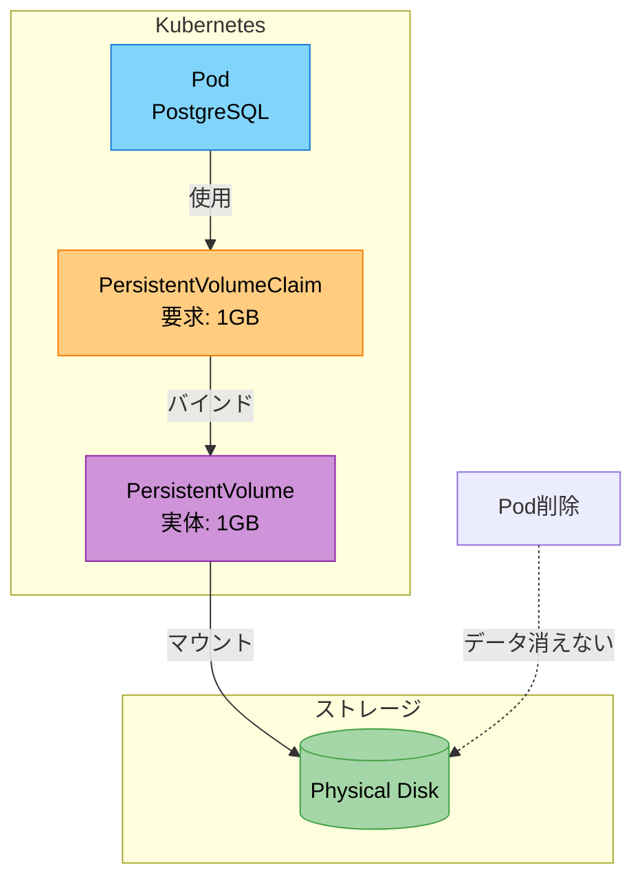

#### 課題

PostgreSQLのデータを永続化

**成果物**:
- [ ] `postgres-pvc.yaml`作成
- [ ] Deploymentにボリュームマウント追加
- [ ] Pod削除後もデータが残ることを確認
- [ ] StatefulSetとの違いレポート

#### セッションで話すこと

- emptyDir vs PersistentVolume
- PV/PVC/StorageClassの関係
- StatefulSetのユースケース
- 本番でのストレージ（EBS, GCE PD）

#### 確認ポイント

- ✅ データ永続化ができるか
- ✅ PV/PVCの仕組みを理解しているか
- ✅ ステートフルアプリの扱いを知っているか

---

### Week 11: Helm導入

#### 今週の目標

- Helmの必要性を理解する
- チャートが作成できる
- 環境別管理ができる

#### Helm構成

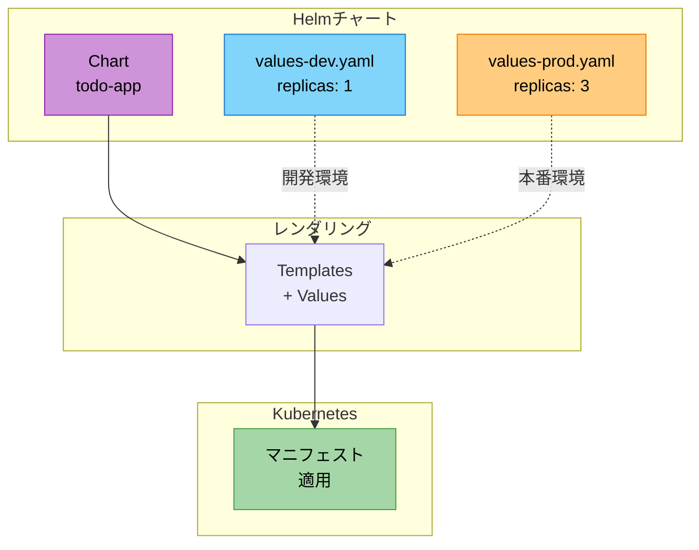

#### 課題

Week 8のアプリをHelmチャート化

**成果物**:
- [ ] `helm create`でチャート作成
- [ ] 既存YAMLをテンプレート化
- [ ] `values-dev.yaml` / `values-prod.yaml`作成
- [ ] `helm install`でデプロイ成功

#### セッションで話すこと

- なぜHelmが必要か（DRY、環境差異管理）
- Chart/Values/Templateの関係
- Go Templateの基本
- `helm upgrade`と`helm rollback`

#### 確認ポイント

- ✅ Helmチャートが作成できるか
- ✅ テンプレート変数が使えるか
- ✅ Helmの価値を説明できるか

---

### Week 12: 総合課題

#### 今週の目標

- 学んだことを統合できる
- 自分で選んだアプリを完全にKubernetesで構築できる
- ドキュメントが書ける

#### 理想的な構成

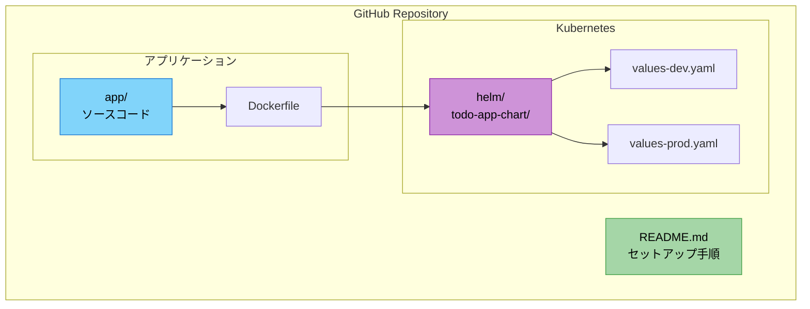

#### 課題

自分で選んだアプリをKubernetesで完全構築

**成果物**:
- [ ] GitHubリポジトリ
- [ ] Dockerfile（最適化済み）
- [ ] Helmチャート
- [ ] README.md（セットアップ手順）
- [ ] アーキテクチャ図
- [ ] 振り返りレポート（学んだこと、次のステップ）

**評価基準**:
- ✅ アプリが正しく動作するか
- ✅ Kubernetesのベストプラクティスに従っているか
- ✅ ドキュメントが充実しているか
- ✅ 自走して構築できたか

#### セッションで話すこと

- 12週間の振り返り
- 実務での適用方法
- 次のステップ（CI/CD、監視、本番運用）
- キャリアパス

#### 確認ポイント

- ✅ 自走できるレベルに達しているか
- ✅ 基本が身についているか
- ✅ 次のステップが見えているか

---

## 修了後の推奨学習パス

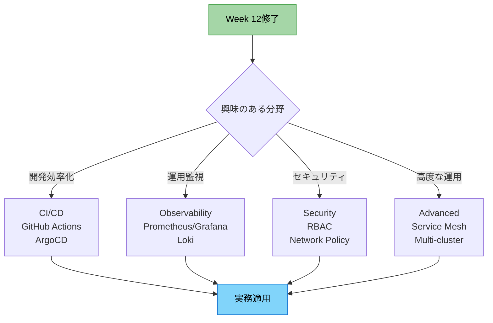
