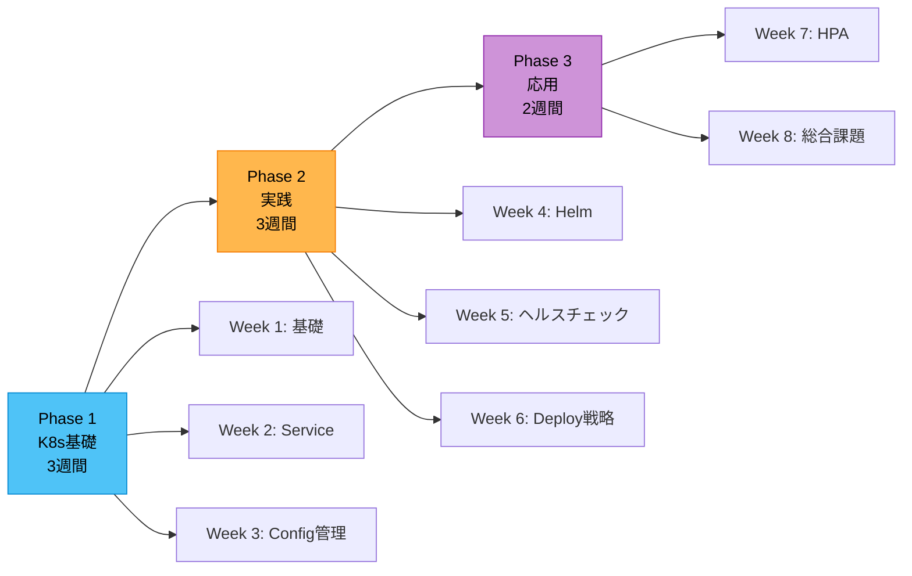
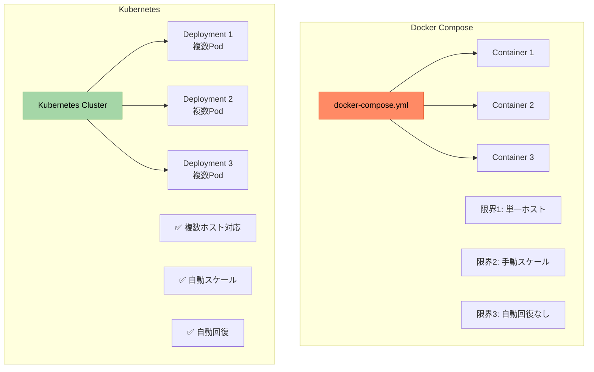
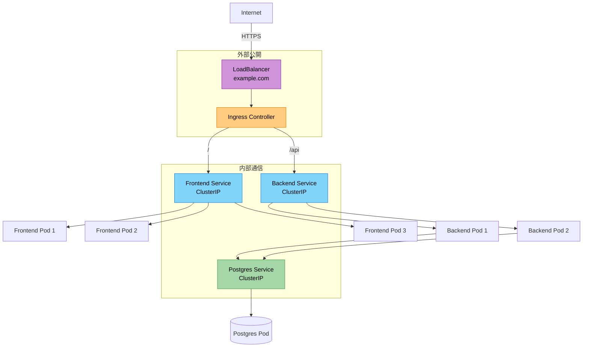
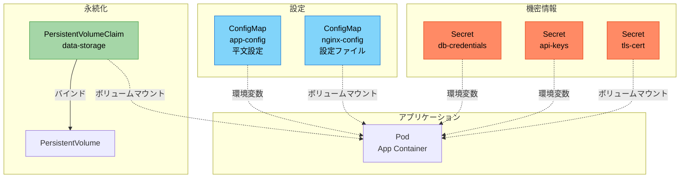
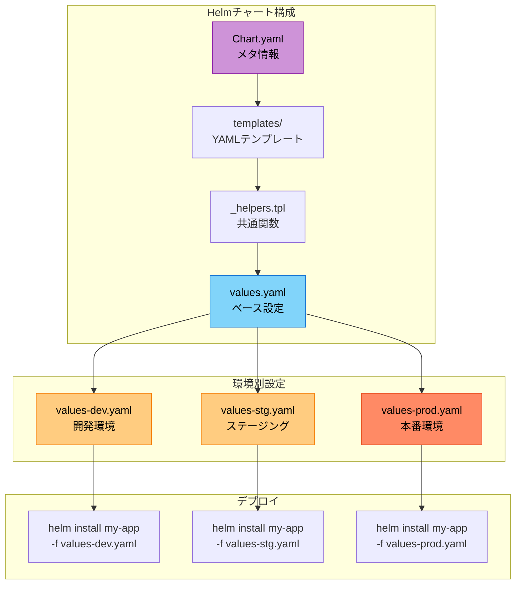
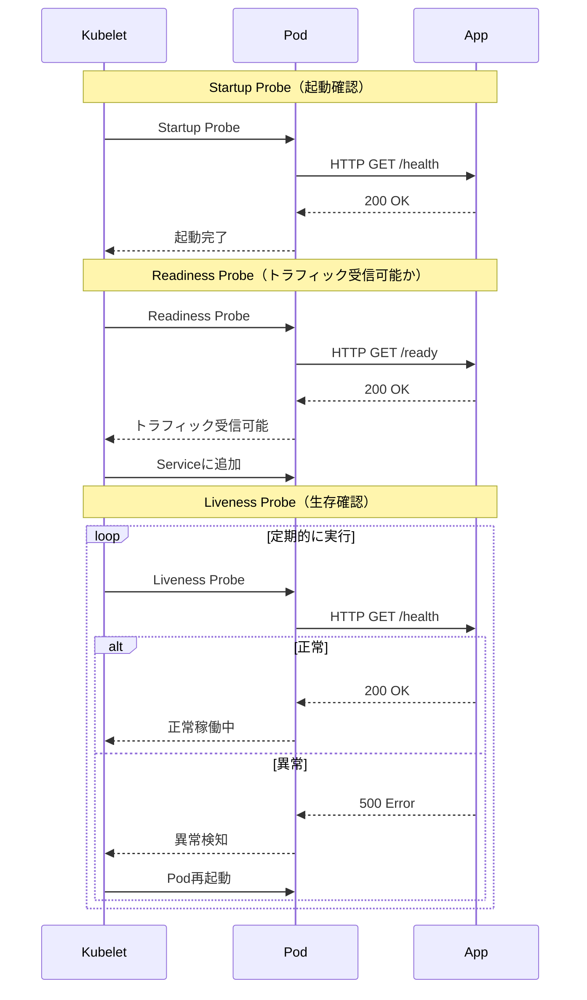
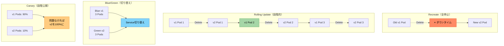
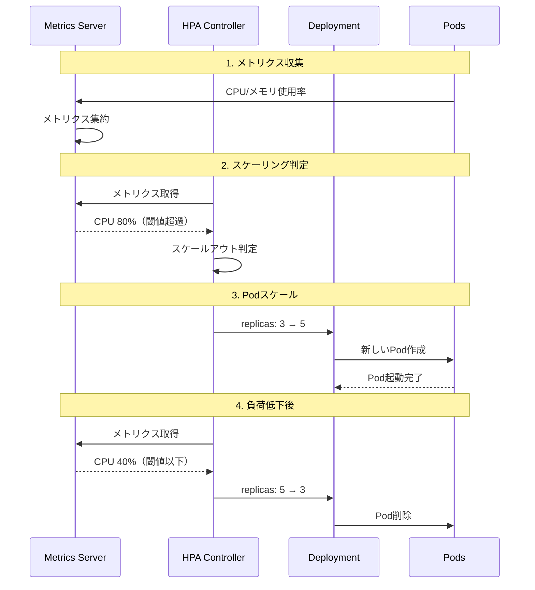
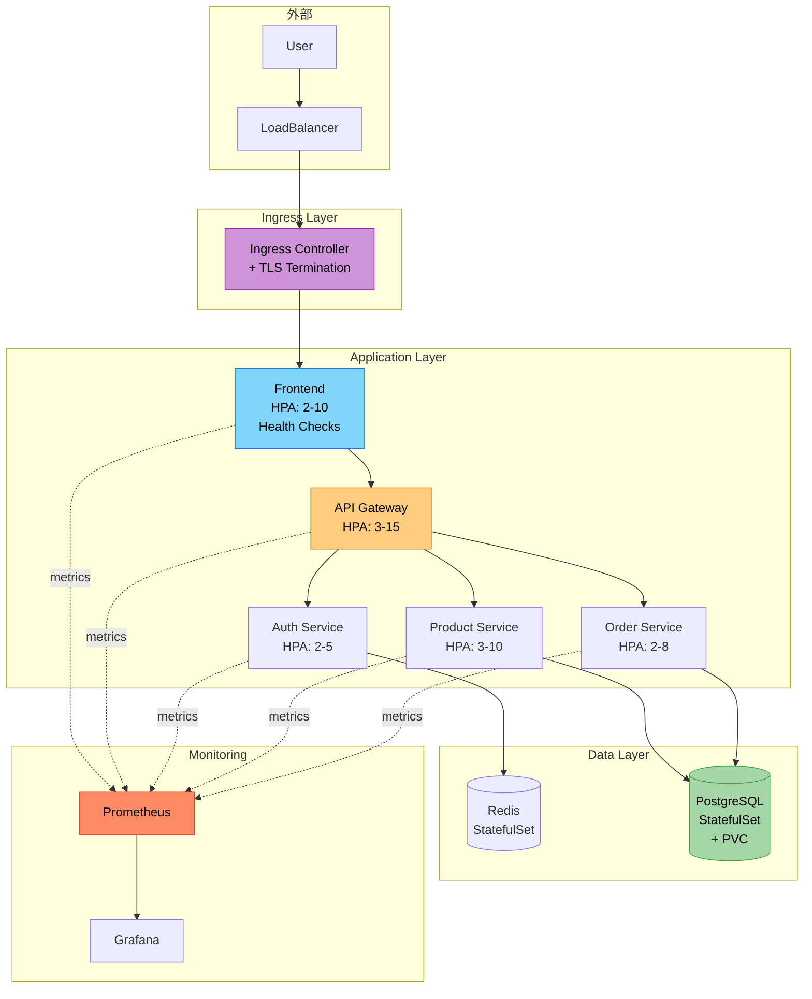
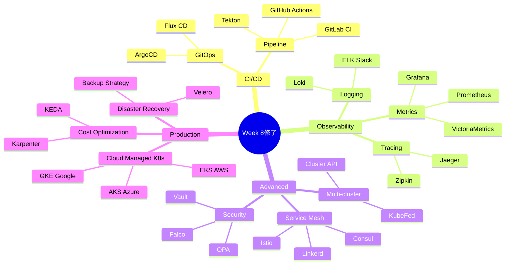

# ルートB: Docker経験者向け（8週間）

Dockerの知識を前提に、Kubernetesの実践的な運用スキルを習得する8週間プログラム

---

## 全体構成



---

## Phase 1: Kubernetes基礎（Week 1-3）

### Week 1: 環境構築 + Pod/Deployment

#### 今週の目標

- DockerとKubernetesの違いを理解する
- Kubernetesの基本リソースが使える
- 既存Dockerアプリを移行できる

#### Docker vs Kubernetes



#### 課題

既存のDocker Composeアプリ（フロント+バック+DB）をKubernetesに移行

**成果物**:
- [ ] 3つの`deployment.yaml`作成
- [ ] 3つの`service.yaml`作成
- [ ] `kubectl apply -f`でデプロイ成功
- [ ] Docker ComposeとK8sの比較表作成

**比較表例**:
| 機能 | Docker Compose | Kubernetes |
|---|---|---|
| 起動コマンド | `docker-compose up` | `kubectl apply -f` |
| スケーリング | 手動 | 宣言的 |
| 自動回復 | なし | あり |
| 複数ホスト | 不可 | 可能 |

#### セッションで話すこと

- Kubernetesの必要性（DockerCompose超える規模）
- 宣言的管理 vs 命令的管理
- Pod/Deployment/ReplicaSetの関係
- ラベルセレクタの重要性

#### 確認ポイント

- ✅ YAMLが書けるか
- ✅ DockerとK8sの違いを説明できるか
- ✅ 移行の勘所を理解しているか

---

### Week 2: Service/Networking + Ingress

#### 今週の目標

- Service種類を使い分けられる
- Ingressでルーティングできる
- ネットワークポリシーを理解する

#### サービス全体像



#### 課題

Week 1のアプリにIngress追加 + パスベースルーティング

**成果物**:
- [ ] Service種類の使い分け（ClusterIP/NodePort/LoadBalancer）
- [ ] `ingress.yaml`作成
- [ ] パスルーティング設定（/, /api, /admin）
- [ ] TLS証明書設定（self-signed）

**発展課題**:
- [ ] Network Policyで通信制限
- [ ] Rate Limitingアノテーション

#### セッションで話すこと

- Service種類の実務での使い分け
- サービスメッシュの概念（軽く触れる）
- 本番でのセキュリティ（WAF、DDoS対策）

#### 確認ポイント

- ✅ Service種類を説明できるか
- ✅ Ingressが設定できるか
- ✅ 本番構成をイメージできるか

---

### Week 3: ConfigMap/Secret/Volume

#### 今週の目標

- 12-factor appを実践できる
- 環境別設定を管理できる
- データ永続化ができる

#### 設定管理パターン



#### 課題

Week 2のアプリを本番想定の設定に変更

**成果物**:
- [ ] ConfigMapで環境別設定（dev/stg/prod）
- [ ] Secretで全ての機密情報管理
- [ ] PVCでPostgreSQLデータ永続化
- [ ] 12-factor app準拠チェックリスト

**チェックリスト**:
- [ ] コードベース: 単一リポジトリ
- [ ] 依存関係: 明示的宣言
- [ ] 設定: 環境変数で管理
- [ ] バックエンドサービス: 接続可能なリソース
- [ ] ビルド、リリース、実行: 分離
- [ ] プロセス: ステートレス
- [ ] ポートバインディング: 自己完結
- [ ] 並行性: プロセスモデル
- [ ] 廃棄容易性: 高速起動、グレースフルシャットダウン
- [ ] 開発/本番一致: 環境を近づける
- [ ] ログ: イベントストリーム
- [ ] 管理プロセス: ワンオフプロセス

#### セッションで話すこと

- 12-factor appの各項目
- 環境変数 vs ボリュームマウントの使い分け
- Secretの暗号化（at-rest, in-transit）
- StatefulSet vs Deploymentの使い分け

#### 確認ポイント

- ✅ 設定外部化ができるか
- ✅ 12-factor appを実践できるか
- ✅ 本番想定の構成を理解しているか

---

## Phase 2: 実践（Week 4-6）

### Week 4: Helm

#### 今週の目標

- Helmの必要性を体感する
- チャート作成ができる
- 環境別デプロイができる

#### Helm活用パターン



#### 課題

Week 3のアプリをHelmチャート化

**成果物**:
- [ ] `helm create`でチャート作成
- [ ] 既存YAMLをテンプレート化
- [ ] `values-dev.yaml`, `values-stg.yaml`, `values-prod.yaml`作成
- [ ] `helm template`でレンダリング確認
- [ ] `helm install`で3環境デプロイ
- [ ] Helm Chart設計ドキュメント

**テンプレート化の例**:
```yaml
# Before
replicas: 3
image: myapp:v1.0.0

# After
replicas: {{ .Values.replicaCount }}
image: "{{ .Values.image.repository }}:{{ .Values.image.tag }}"
```

#### セッションで話すこと

- なぜHelmが必要か（DRY、環境管理）
- Go Templateの基本構文
- `_helpers.tpl`の活用
- Chart Hooksの使い方
- Helm Repositoryでの共有

#### 確認ポイント

- ✅ Helmチャートが作成できるか
- ✅ テンプレート構文が理解できているか
- ✅ 環境別管理ができるか

---

### Week 5: ヘルスチェック/リソース制限

#### 今週の目標

- Liveness/Readiness Probeが設定できる
- リソース制限の重要性を理解する
- 自動回復する堅牢なアプリを作れる

#### ヘルスチェックフロー



#### 課題

Week 4のアプリにヘルスチェックとリソース制限を追加

**成果物**:
- [ ] Startup/Liveness/Readiness Probe設定
- [ ] リソース制限（requests/limits）設定
- [ ] Podの自動再起動確認
- [ ] リソース不足時の挙動確認
- [ ] メトリクス収集設定

**Probe設定例**:
```yaml
livenessProbe:
  httpGet:
    path: /health
    port: 8080
  initialDelaySeconds: 30
  periodSeconds: 10

readinessProbe:
  httpGet:
    path: /ready
    port: 8080
  initialDelaySeconds: 5
  periodSeconds: 5

resources:
  requests:
    cpu: 100m
    memory: 128Mi
  limits:
    cpu: 500m
    memory: 512Mi
```

#### セッションで話すこと

- Startup/Liveness/Readinessの違い
- リソース requests vs limits
- QoS Class（Guaranteed, Burstable, BestEffort）
- OOMKillerの仕組み
- メトリクスサーバーの導入

#### 確認ポイント

- ✅ ヘルスチェックが設定できるか
- ✅ リソース制限の重要性を理解しているか
- ✅ 本番運用を意識した設定ができるか

---

### Week 6: ローリングアップデート/Rollback

#### 今週の目標

- デプロイ戦略を理解する
- ゼロダウンタイムデプロイができる
- ロールバックができる

#### デプロイ戦略比較



#### 課題

Week 5のアプリで各種デプロイ戦略を実践

**成果物**:
- [ ] Rolling Updateでイメージ更新
- [ ] Rollbackで前バージョンに戻す
- [ ] Blue/Green デプロイ実装
- [ ] Canary デプロイ実装（手動）
- [ ] デプロイ戦略比較レポート

**Rolling Update設定**:
```yaml
strategy:
  type: RollingUpdate
  rollingUpdate:
    maxSurge: 1        # 同時に作成できる超過Pod数
    maxUnavailable: 0  # 同時に停止できるPod数
```

#### セッションで話すこと

- デプロイ戦略の使い分け
- `kubectl rollout`コマンド
- Helm Releaseのロールバック
- ArgoCD/Fluxによる継続的デプロイ（紹介）
- 本番でのデプロイフロー

#### 確認ポイント

- ✅ ゼロダウンタイムデプロイができるか
- ✅ ロールバックができるか
- ✅ デプロイ戦略を説明できるか

---

## Phase 3: 応用（Week 7-8）

### Week 7: HPA（Horizontal Pod Autoscaler）

#### 今週の目標

- オートスケーリングを実装できる
- メトリクスベースの自動化を理解する
- スケーリング戦略を設計できる

#### HPAの仕組み



#### 課題

Week 6のアプリにHPAを追加 + 負荷テスト

**成果物**:
- [ ] Metrics Server導入
- [ ] HPA設定（CPU/メモリベース）
- [ ] 負荷テストツール導入（Apache Bench / K6）
- [ ] スケールアウト/スケールインの確認
- [ ] カスタムメトリクス（Prometheus）によるスケーリング

**HPA設定例**:
```yaml
apiVersion: autoscaling/v2
kind: HorizontalPodAutoscaler
metadata:
  name: backend-hpa
spec:
  scaleTargetRef:
    apiVersion: apps/v1
    kind: Deployment
    name: backend
  minReplicas: 2
  maxReplicas: 10
  metrics:
  - type: Resource
    resource:
      name: cpu
      target:
        type: Utilization
        averageUtilization: 70
```

#### セッションで話すこと

- HPAとVPAの違い
- メトリクスの種類（Resource, Pods, Object, External）
- Cluster Autoscalerとの連携
- スケーリングのベストプラクティス
- コスト最適化

#### 確認ポイント

- ✅ HPAが設定できるか
- ✅ 負荷テストができるか
- ✅ スケーリング戦略を説明できるか

---

### Week 8: 総合課題 + 次のステップ

#### 今週の目標

- 学んだことを統合できる
- マイクロサービスアプリを構築できる
- 次のステップを理解している

#### 理想的なアーキテクチャ



#### 課題

マイクロサービスアプリケーションの完全構築

**要件**:
- [ ] 3つ以上のマイクロサービス
- [ ] Helmチャート（環境別設定）
- [ ] ヘルスチェック + リソース制限
- [ ] HPA設定
- [ ] Ingress + TLS
- [ ] ConfigMap/Secret管理
- [ ] データ永続化
- [ ] 監視（Prometheus + Grafana）
- [ ] CI/CDパイプライン（GitHub Actions）
- [ ] ドキュメント完備

**成果物**:
- [ ] GitHubリポジトリ
- [ ] アーキテクチャ図
- [ ] セットアップガイド
- [ ] 運用手順書
- [ ] 振り返りレポート

#### セッションで話すこと

- 8週間の振り返り
- 実務でのKubernetes活用
- 次のステップ候補:
  - **CI/CD**: ArgoCD, Flux, Tekton
  - **Service Mesh**: Istio, Linkerd
  - **Observability**: ELK Stack, Jaeger（分散トレーシング）
  - **Security**: Falco, OPA/Gatekeeper
  - **本番環境**: EKS/GKE/AKS
- キャリアパス

#### 確認ポイント

- ✅ 実務レベルのアプリが構築できるか
- ✅ ベストプラクティスに従っているか
- ✅ 自走できるか

---

## 修了後の推奨学習パス



---

## 実務適用チェックリスト

### アーキテクチャ設計

- [ ] マイクロサービス分割戦略
- [ ] API Gateway選定
- [ ] データベース戦略（1 DB per service）
- [ ] キャッシュ戦略
- [ ] 非同期通信（Message Queue）

### セキュリティ

- [ ] RBAC設定
- [ ] Network Policy
- [ ] Pod Security Standards
- [ ] Secret管理（Vault/Sealed Secrets）
- [ ] Image Scanning

### 監視・ロギング

- [ ] Prometheus + Grafana
- [ ] アラート設定
- [ ] ログ集約
- [ ] 分散トレーシング
- [ ] SLI/SLO/SLA定義

### 運用

- [ ] GitOps（ArgoCD/Flux）
- [ ] バックアップ戦略
- [ ] Disaster Recovery
- [ ] コスト監視
- [ ] ドキュメント整備

---
