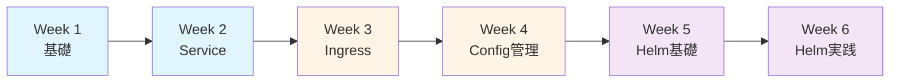
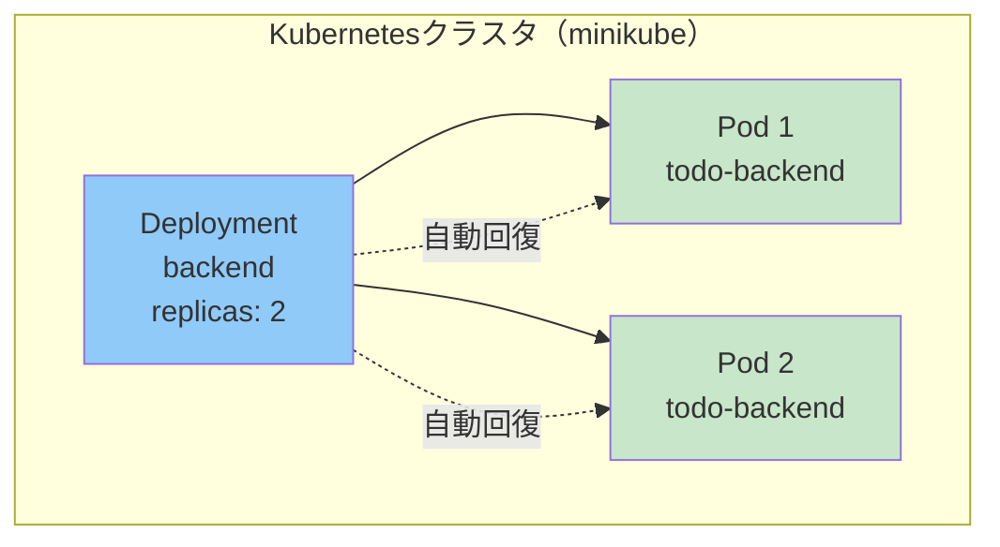
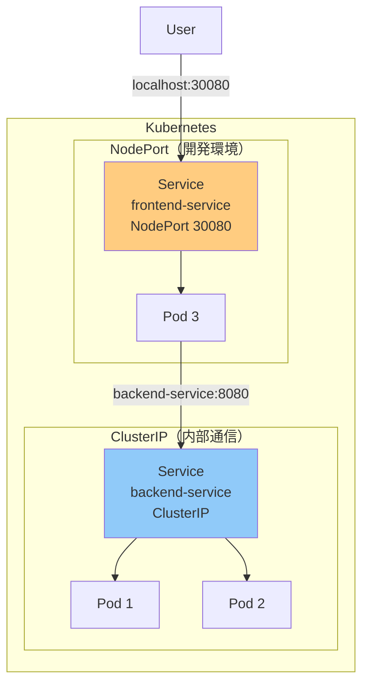
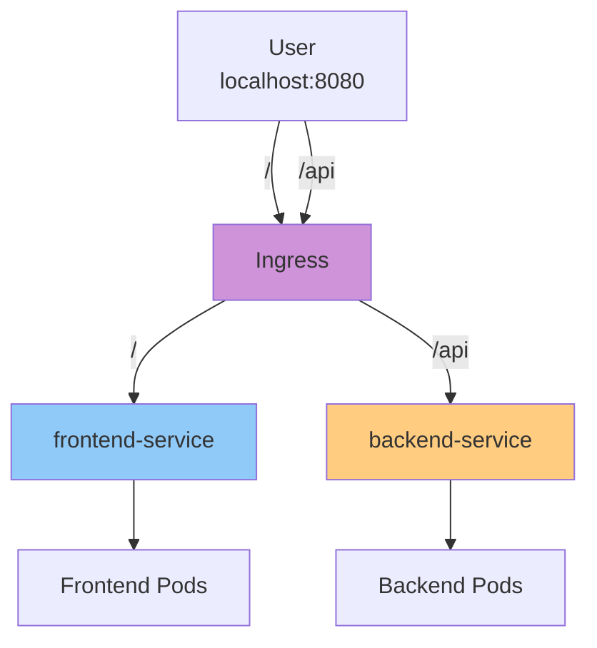
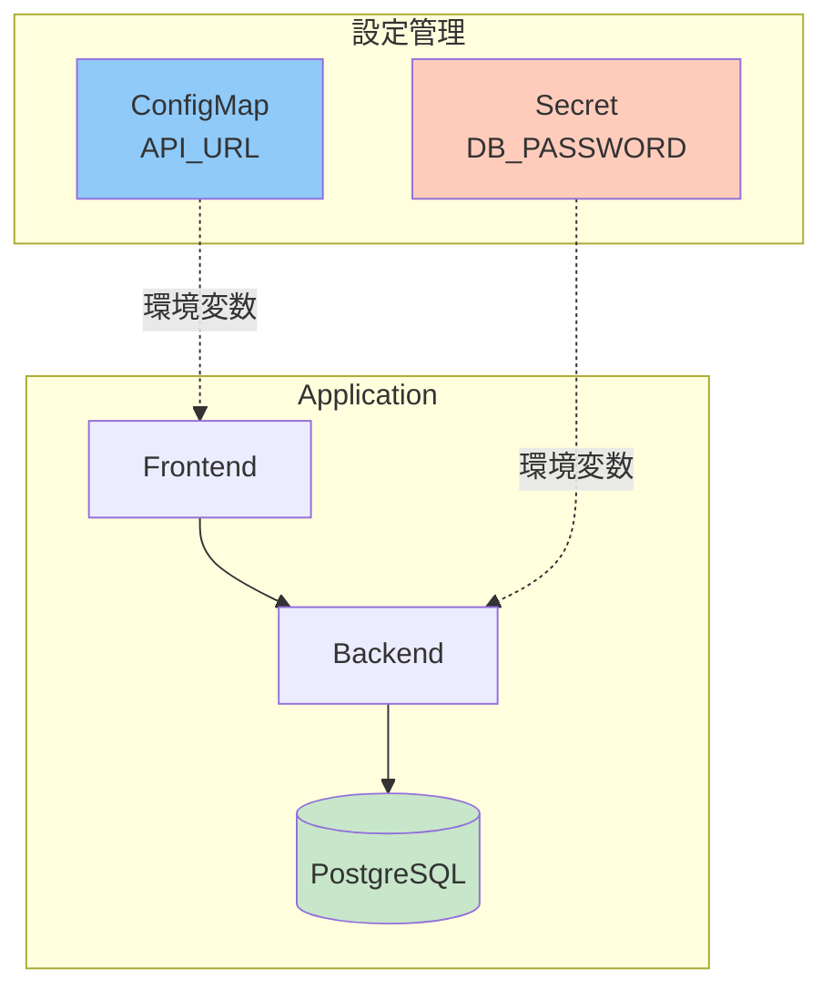
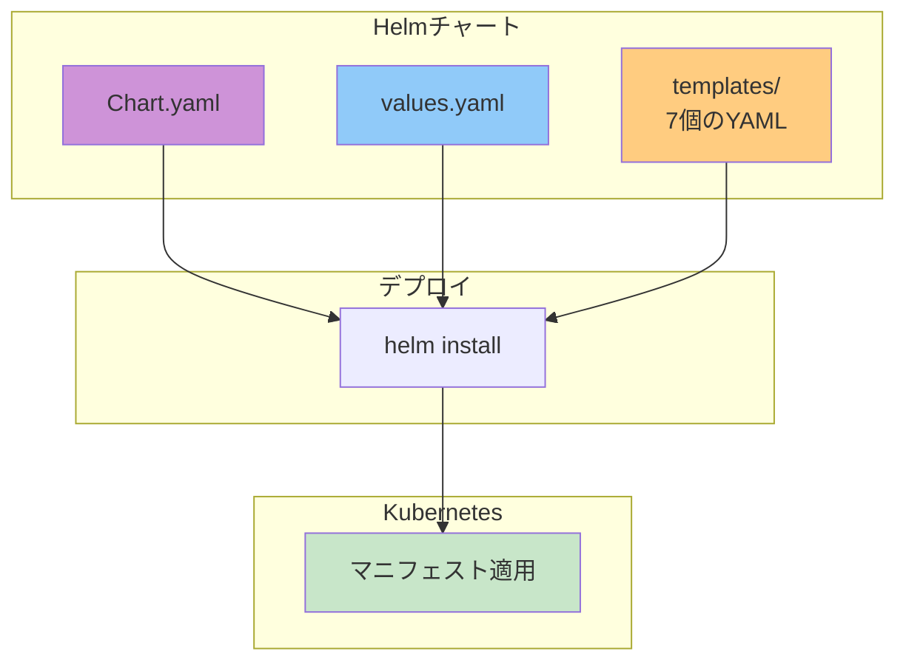
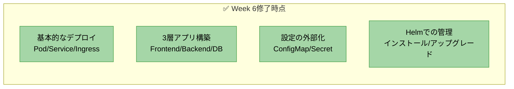
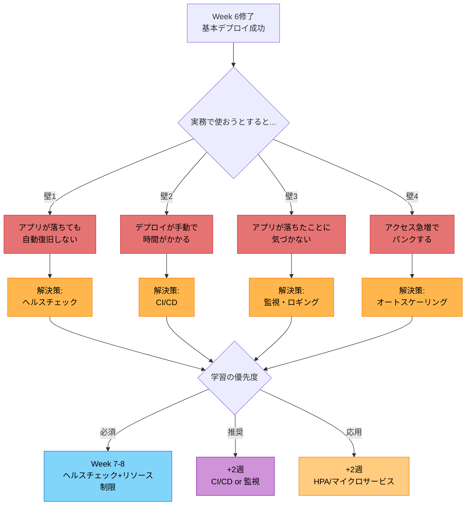
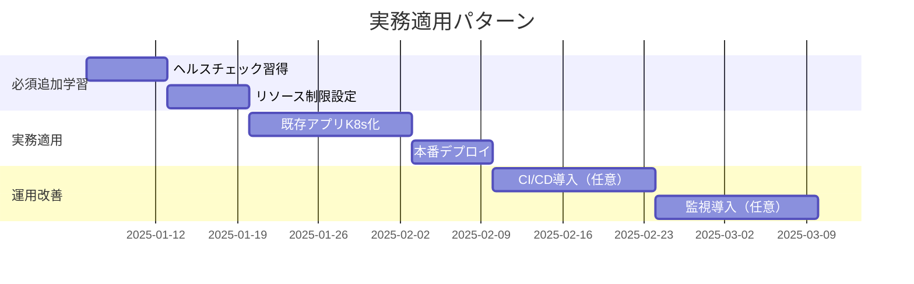
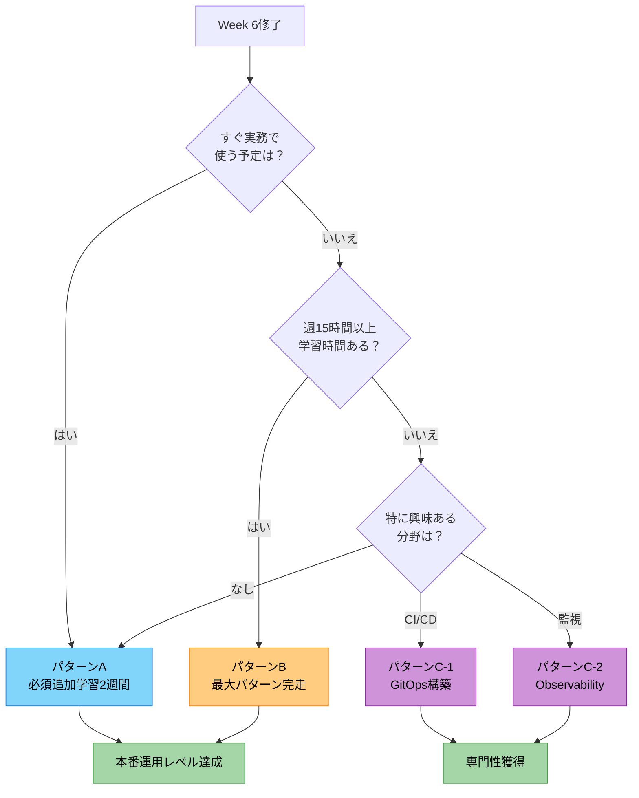

# ルートB: Docker経験者向け（最低限パターン・6週間）

Dockerの知識を前提に、Kubernetesの**実務で最低限必要なスキル**を習得する6週間プログラム

---

## 最低限 vs 最大パターン

| 項目 | 最低限（6週） | 最大（8週） |
|---|---|---|
| **到達目標** | 基礎固め、実務で使える | 本番運用レベル |
| **Pod/Service/Ingress** | ✅ | ✅ |
| **ConfigMap/Secret** | ✅ | ✅ |
| **Helm** | ✅ | ✅ |
| **ヘルスチェック** | ❌ | ✅ |
| **デプロイ戦略** | ❌ | ✅ |
| **HPA** | ❌ | ✅ |
| **マイクロサービス** | ❌ | ✅ |

**このパターンが向いている人**:
- まず基礎を確実に固めたい
- 週の学習時間が10時間以下
- 業務でシンプルなK8sデプロイができればOK

---

## 全体構成



---

## Week 1: 環境構築 + Pod/Deployment

### 今週の目標

- minikubeでクラスタを起動できる
- Pod/Deploymentの違いを理解する
- YAMLマニフェストが書ける

### システム構成



### 課題

既存のlocalhostで動くアプリをDocker化。そしてDockerアプリ（バックエンド1つ）をKubernetesにデプロイ

**成果物**:
- [ ] minikube起動
- [ ] `backend-deployment.yaml`作成
- [ ] `kubectl apply -f`でデプロイ
- [ ] `kubectl get pods`で確認
- [ ] Podを削除して自動再起動を確認

**deployment.yaml雛形**:
```yaml
apiVersion: apps/v1
kind: Deployment
metadata:
  name: backend
spec:
  replicas: 2
  selector:
    matchLabels:
      app: backend
  template:
    metadata:
      labels:
        app: backend
    spec:
      containers:
      - name: backend
        image: your-backend:latest
        imagePullPolicy: Never  # minikube用
        ports:
        - containerPort: 8080
```

### セッションで話すこと

- DockerとKubernetesの違い
- Podとは何か
- Deploymentの役割（自動回復、レプリカ管理）
- YAMLの基本構造

### 確認ポイント

- ✅ minikubeが起動できるか
- ✅ YAMLが書けるか
- ✅ Podのライフサイクルを理解しているか

---

## Week 2: Service

### 今週の目標

- Serviceの役割を理解する
- ClusterIP/NodePortの違いを知る
- Pod間通信ができる

### Service種類（シンプル版）



### 課題

フロントエンド + バックエンドの2層構成

**成果物**:
- [ ] frontend-deployment.yaml + service.yaml（NodePort）
- [ ] backend-deployment.yaml + service.yaml（ClusterIP）
- [ ] Pod間通信成功（frontend → backend）
- [ ] ブラウザで`localhost:30080`アクセス

**service.yaml例**:
```yaml
# backend-service.yaml
apiVersion: v1
kind: Service
metadata:
  name: backend-service
spec:
  type: ClusterIP
  selector:
    app: backend
  ports:
  - port: 8080
    targetPort: 8080

# frontend-service.yaml
apiVersion: v1
kind: Service
metadata:
  name: frontend-service
spec:
  type: NodePort
  selector:
    app: frontend
  ports:
  - port: 3000
    targetPort: 3000
    nodePort: 30080
```

### セッションで話すこと

- Serviceの役割（ロードバランサー、DNS）
- ClusterIP vs NodePort
- DNS名でのPod間通信
- ラベルセレクタの仕組み

### 確認ポイント

- ✅ Service YAMLが書けるか
- ✅ Pod間通信ができるか
- ✅ DNS名を理解しているか

---

## Week 3: Ingress

### 今週の目標

- Ingressの役割を理解する
- パスベースルーティングができる
- 1つのURLで全体にアクセスできる

### Ingress構成



### 課題

Ingressでパスベースルーティング

**成果物**:
- [ ] Ingress Controller有効化（`minikube addons enable ingress`）
- [ ] `ingress.yaml`作成
- [ ] `/` → frontend
- [ ] `/api` → backend
- [ ] `kubectl port-forward`でアクセス確認

**ingress.yaml**:
```yaml
apiVersion: networking.k8s.io/v1
kind: Ingress
metadata:
  name: app-ingress
spec:
  rules:
  - http:
      paths:
      - path: /api
        pathType: Prefix
        backend:
          service:
            name: backend-service
            port:
              number: 8080
      - path: /
        pathType: Prefix
        backend:
          service:
            name: frontend-service
            port:
              number: 3000
```

### セッションで話すこと

- Ingress Controllerとは
- パスベースルーティング
- **本番ではLoadBalancerを使う**（minikubeでは疑似的）
- 今後の発展（TLS、認証）

### 確認ポイント

- ✅ Ingressが設定できるか
- ✅ パスルーティングを理解しているか
- ✅ 本番との違いを知っているか

---

## Week 4: ConfigMap/Secret + PostgreSQL

### 今週の目標

- 設定と機密情報を分離できる
- データベースを追加できる
- 環境変数の扱いを学ぶ

### 3層構成



### 課題

PostgreSQL追加 + 設定外部化

**成果物**:
- [ ] postgres-deployment.yaml + service.yaml
- [ ] postgres-secret.yaml（DB認証情報）
- [ ] バックエンドの環境変数をConfigMap/Secretから注入
- [ ] フロントエンド → バックエンド → DB の疎通確認

**secret.yaml例**:
```yaml
apiVersion: v1
kind: Secret
metadata:
  name: postgres-secret
type: Opaque
stringData:
  POSTGRES_USER: todouser
  POSTGRES_PASSWORD: todopass
  POSTGRES_DB: tododb
```

**Deploymentでの使用例**:
```yaml
env:
- name: POSTGRES_PASSWORD
  valueFrom:
    secretKeyRef:
      name: postgres-secret
      key: POSTGRES_PASSWORD
```

### セッションで話すこと

- ConfigMapとSecretの違い
- 環境変数 vs ボリュームマウント
- **本番ではSecretを暗号化** (Sealed Secrets, Vault)
- 12-factor app（設定の外部化）

### 確認ポイント

- ✅ ConfigMap/Secretが作成できるか
- ✅ 機密情報の扱いを理解しているか
- ✅ 3層構成が動作するか

---

## Week 5: Helm基礎

### 今週の目標

- Helmの必要性を理解する
- 既存YAMLをHelmチャート化できる
- values.yamlで値を管理できる

### Helm構成



### 課題

Week 4のアプリをHelmチャート化

**成果物**:
- [ ] `helm create todo-app-chart`
- [ ] 既存の7個のYAMLをtemplates/にコピー
- [ ] `Chart.yaml`編集
- [ ] `values.yaml`作成（最低限）
- [ ] `helm install todo-app ./todo-app-chart`成功

**最低限のvalues.yaml**:
```yaml
backend:
  image:
    repository: todo-backend
    tag: latest
  replicas: 2

frontend:
  image:
    repository: todo-frontend
    tag: latest
  replicas: 1

postgres:
  enabled: true
```

### セッションで話すこと

- なぜHelmが必要か（DRY、バージョン管理）
- Chart/Values/Templateの関係
- **次週でテンプレート化を進める**

### 確認ポイント

- ✅ Helmの必要性を理解しているか
- ✅ チャートが作成できるか
- ✅ helm installができるか

---

## Week 6: Helm実践 + 総まとめ

### 今週の目標

- YAMLをテンプレート化できる
- 値を一元管理できる
- 自走してKubernetesアプリをデプロイできる

### テンプレート化

```mermaid
graph LR
    subgraph "Before（Week 5）"
        Y1[backend-deployment.yaml<br/>replicas: 2<br/>image: todo-backend:latest]
    end

    subgraph "After（Week 6）"
        T1[backend-deployment.yaml<br/>replicas: {{ .Values.backend.replicas }}<br/>image: {{ .Values.backend.image.repository }}:{{ .Values.backend.image.tag }}]
        V1[values.yaml<br/>backend:<br/>  replicas: 2<br/>  image:<br/>    repository: todo-backend<br/>    tag: latest]
    end

    Y1 -.テンプレート化.-> T1
    V1 --> T1

    style Y1 fill:#ffccbc
    style T1 fill:#c8e6c9
    style V1 fill:#90caf9
```

### 課題

Week 5のチャートをテンプレート化 + 総合課題

**成果物**:
- [ ] 主要な値を`{{ .Values.xxx }}`に置き換え
  - replicas
  - image repository/tag
  - service ports
- [ ] `helm upgrade`でアップグレード成功
- [ ] `helm rollback`でロールバック成功
- [ ] GitHubリポジトリ作成
- [ ] README.md作成（セットアップ手順）

**テンプレート化の例**:
```yaml
# templates/backend-deployment.yaml
spec:
  replicas: {{ .Values.backend.replicas }}
  template:
    spec:
      containers:
      - name: backend
        image: "{{ .Values.backend.image.repository }}:{{ .Values.backend.image.tag }}"
        ports:
        - containerPort: {{ .Values.backend.service.port }}
```

### セッションで話すこと

- Go Templateの基本構文
- `helm upgrade`と`helm rollback`
- **6週間の振り返り**
- 次のステップ（選択肢）

### 確認ポイント

- ✅ テンプレート化ができるか
- ✅ helm upgrade/rollbackができるか
- ✅ 基礎が身についているか

---

## 修了後の選択肢

### Week 6修了時点でできること



### 実務適用するとぶつかる壁



### 推奨学習パス

#### パターンA: 実務ですぐ使う（推奨）



**Week 7（追加学習1週目）**:
- **課題**: TODOアプリにヘルスチェック追加
- **学ぶこと**: Liveness/Readiness Probe、再起動ポリシー
- **成果**: アプリが自動復旧するようになる

**Week 8（追加学習2週目）**:
- **課題**: リソース制限を設定
- **学ぶこと**: requests/limits、OOMKiller
- **成果**: リソース枯渇を防げる

**Week 9〜（実務適用）**:
- 業務の既存アプリをKubernetes化
- 学んだことを実践
- 詰まったら都度学習

**期間**: 2週間の追加学習 + 実務適用1〜2ヶ月

---

#### パターンB: 最大パターン完走（体系的に学びたい人向け）

[Week 7-8の詳細は最大パターンを参照](./route-b-docker-experienced.md#phase-3-応用week-7-8)

**Week 7: 本番運用の基礎**
- ヘルスチェック（Liveness/Readiness Probe）
- リソース制限（requests/limits）
- ローリングアップデート戦略

**Week 8: 総合課題**
- HPA（オートスケーリング）
- マイクロサービス構築
- Helmでの環境別管理（dev/stg/prod）

**こんな人におすすめ**:
- 体系的に学びたい
- 週15〜20時間の学習時間が取れる
- 実務適用前に一通りマスターしたい

**期間**: +2週間

---

#### パターンC: 特定領域を深掘り（興味に応じて）

##### C-1: CI/CDを構築したい

**やること**:
1. GitHub Actions導入（1週目）
   - Dockerイメージのビルド・プッシュ
   - テスト自動化
2. ArgoCD導入（2週目）
   - GitOpsフロー構築
   - 自動デプロイ

**ゴール**: コードをpushしたら自動でKubernetesにデプロイされる

**期間**: 2〜3週間

##### C-2: 監視・ロギングを構築したい

**やること**:
1. Prometheus + Grafana導入（1〜2週目）
   - メトリクス収集
   - ダッシュボード作成
   - アラート設定
2. ログ収集（2〜3週目）
   - Loki or ELK Stack導入
   - ログ可視化

**ゴール**: アプリの状態を可視化し、障害に気づける

**期間**: 2〜3週間

---

### 迷ったら？ 推奨フロー



**結論**: 迷ったら**パターンA（実務適用）**推奨。ヘルスチェックとリソース制限だけ追加学習して、あとは実務で学ぶのが最も効率的。

---

## 最低限パターンで到達できるレベル

### ✅ できること

- Kubernetesの基本リソース（Pod/Deployment/Service/Ingress）が使える
- YAMLマニフェストが書ける
- Helmチャートが作成・管理できる
- 3層アプリケーションがデプロイできる
- 設定を外部化できる

### ⚠️ まだできないこと

- 本番運用レベルの設定（ヘルスチェック、リソース制限）
- デプロイ戦略（Blue/Green、Canary）
- オートスケーリング
- 監視・ロギング
- CI/CDパイプライン

### 💡 実務で困らないために

最低限パターン修了後、**実務で使う前に**以下を追加学習推奨：

1. **ヘルスチェック**（必須）
   - Liveness/Readiness Probe
   - 自動回復の仕組み

2. **リソース制限**（必須）
   - requests/limits
   - OOMKillerを避ける

3. **Secret管理**（本番なら必須）
   - Sealed Secrets or Vault
   - 平文Secretは危険

---

## 最低限 vs 最大の比較表

| 項目 | 最低限（6週） | 最大（8週） |
|---|---|---|
| **学習時間/週** | 5~10時間 | 15~20時間 |
| **到達レベル** | 基礎固め | 本番運用可能 |
| **Pod/Service/Ingress** | ✅ | ✅ |
| **ConfigMap/Secret** | ✅ | ✅ |
| **Helm** | ✅ 基礎 | ✅ 実践 |
| **ヘルスチェック** | ❌ | ✅ |
| **リソース制限** | ❌ | ✅ |
| **デプロイ戦略** | ❌ | ✅ |
| **HPA** | ❌ | ✅ |
| **総合課題** | シンプルアプリ | マイクロサービス |
| **実務適用** | 基本的なデプロイ | 本番運用 |

---

## よくある質問

**Q: 最低限パターンで実務は大丈夫？**

A: シンプルなアプリなら大丈夫。ただし、**本番運用前にヘルスチェックとリソース制限は必須**。

**Q: 途中から最大パターンに切り替えられる？**

A: 可能。Week 6修了後、Week 7-8を追加すればOK。

**Q: 6週間で終わらなかったら？**

A: 無理に進めず、理解を優先。Week 4-6を2週ずつにしてもOK（8週間に延長）。

**Q: minikubeだけで十分？**

A: 学習には十分。本番はEKS/GKE/AKSを使うが、基本は同じ。

---
